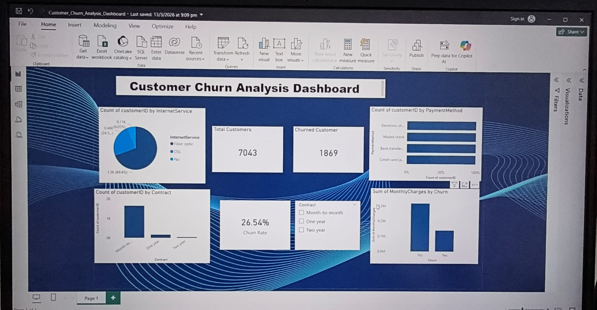
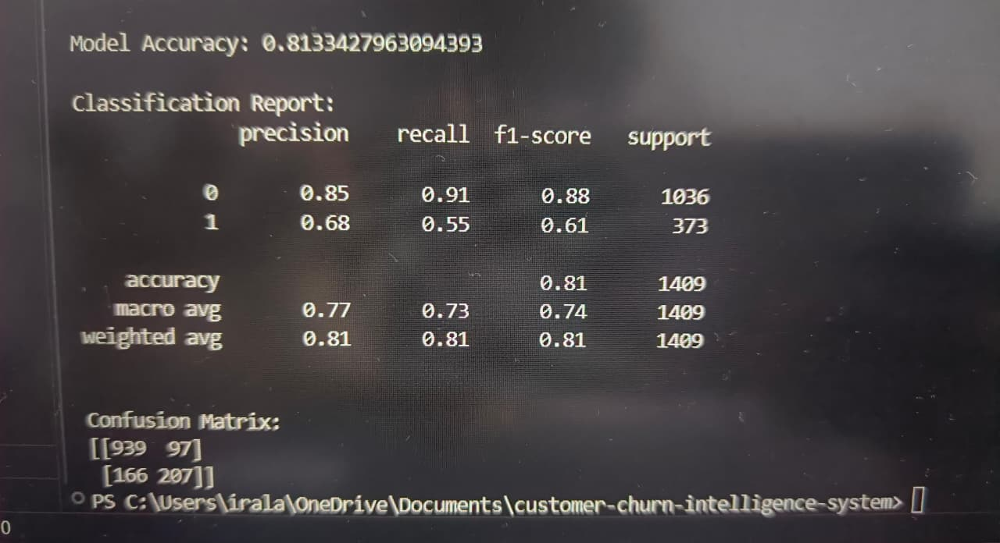

# Customer Churn Analysis & Prediction

---

## Dashboard Preview

---

## Project Overview

Customer churn is a major challenge for telecom companies.  
This project analyzes customer churn using the **Telco Customer Churn dataset** and identifies the key factors influencing customer attrition.

The project combines **data analysis, machine learning, and interactive visualization** to generate actionable business insights.

---

## Dataset Information

**Dataset:** Telco Customer Churn Dataset

- **Total Customers:** 7043  
- **Churned Customers:** 1869  
- **Features:** 21  

The dataset contains customer demographics, account information, and service usage patterns used to predict churn behavior.

---

## Technologies Used

- Python
- Pandas
- NumPy
- Matplotlib
- Seaborn
- Scikit-Learn
- Power BI

---

## Key Insights

- Customers with **month-to-month contracts churn the most**
- Customers using **electronic check payments show higher churn**
- **Higher monthly charges correlate with higher churn probability**
- **Long-term contracts significantly reduce churn risk**

---

## Model Performance

| Metric | Score |
|------|------|
| Accuracy | 80% |
| Precision | 74% |
| Recall | 65% |
| F1 Score | 69% |

**Model Used:** Logistic Regression

---

## Model Evaluation

---

## Project Outputs

The project includes:

- Exploratory Data Analysis
- Feature importance analysis
- Churn distribution visualizations
- Machine learning churn prediction model
- Power BI interactive dashboard

---

## Business Value

This system helps telecom companies:

- Identify high-risk customers
- Understand churn drivers
- Improve retention strategies
- Reduce revenue loss

---

## Project Architecture

Dataset  
→ Data Cleaning  
→ Exploratory Data Analysis  
→ Feature Engineering  
→ Model Training  
→ Prediction  
→ Business Insights Dashboard  

---

## Project Structure
customer-churn-analysis/ │ ├── data/ ├── notebooks/ ├── scripts/ ├── outputs/ │   ├── churn_distribution.png │   ├── model_results.png │   └── Dashboard_preview.jpeg │ ├── architecture/ ├── INSIGHTS.md └── README.md
